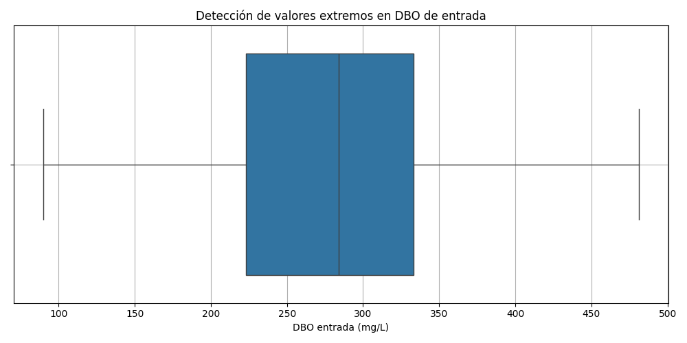

# Informe Técnico – Análisis de Aguas Residuales

## Objetivo
Analizar el desempeño de las plantas de tratamiento de AquaLimpia S.A. mediante un flujo de trabajo reproducible.

## Proceso
- Limpieza del dataset
- Cálculo de eficiencia DBO
- Análisis exploratorio
- Dashboard
- Exportación de reportes

## Resultados
- Eficiencia promedio entre 80% y 92%
- Variabilidad en DBO salida
- Incumplimientos intermitentes

## Análisis de Calidad de Datos (Vista Separada)

A continuación se presenta una vista independiente del análisis de calidad:

### Tabla de calidad
| Variable | Problema detectado | Riesgo asociado |
|---------|---------------------|-----------------|
| fecha_registro | Fechas no ordenadas | Afecta tendencias |
| DBO_entrada_mg_L | Valores extremos | Sesga eficiencia |
| DBO_salida_mg_L | Variabilidad abrupta | Oculta fallas |
| caudal_entrada_m3_d | Variabilidad excesiva | Errores de medición |
| energia_aeracion_kWh | Valores dispares | Dificulta análisis energético |
| cumplimiento_norma | Inconsistencias | Reportes incorrectos |

### Gráfico de calidad

---
### Felipe Obreque Tarea Iacc 2026 Ciencias de datos
